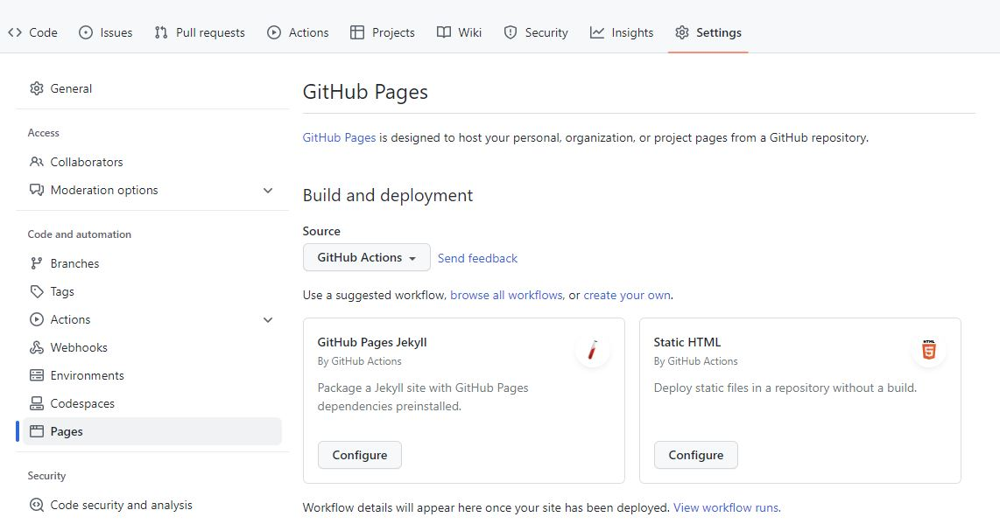
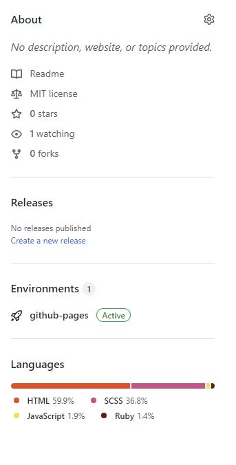
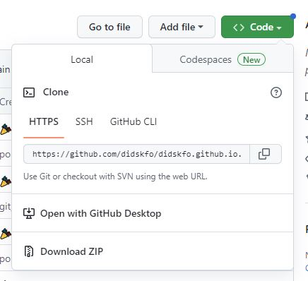
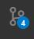
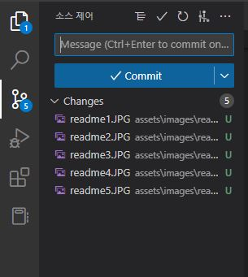
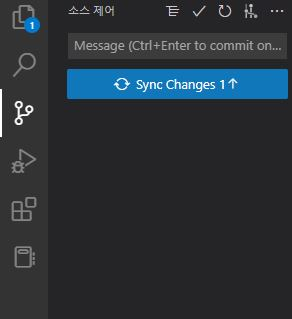
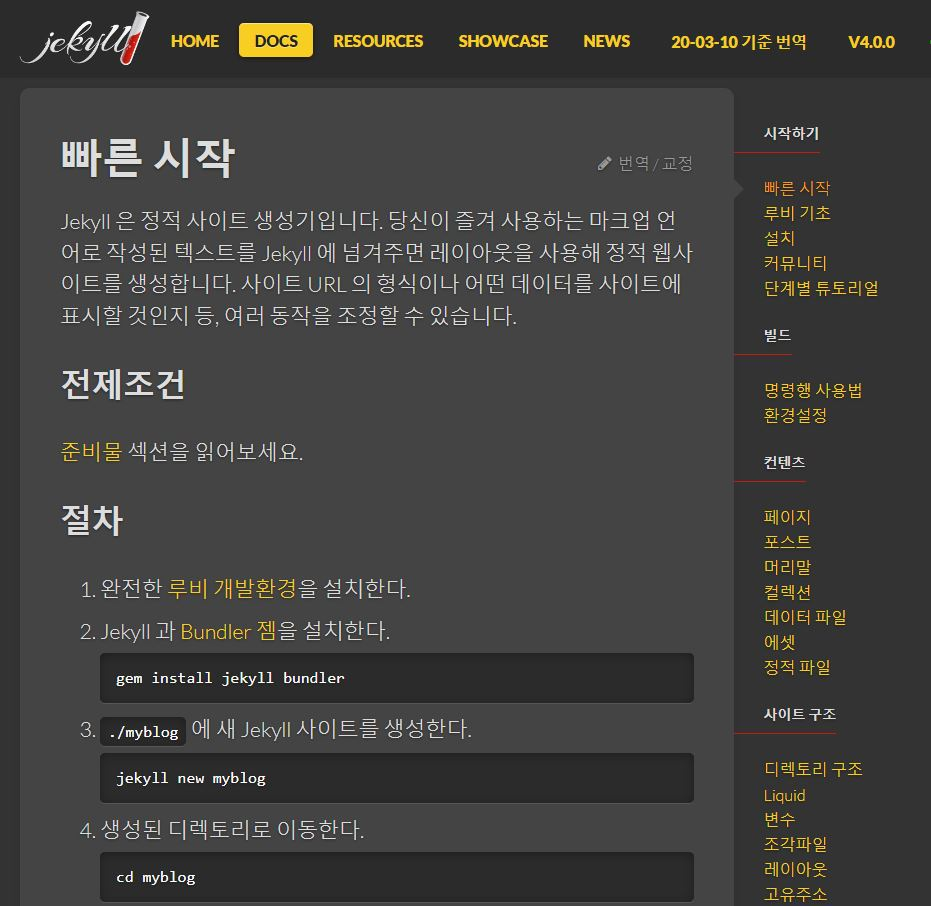
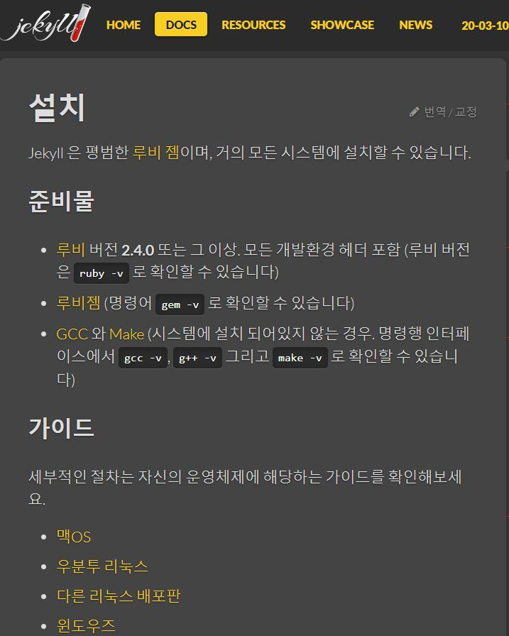

<!-- 1. 테마 찾는거 
2. 내용 정리 
3. 댓글 기능 넣기  
4. 문제 생긴거 해결한거
5. favicon 넣은거
6. 루비랑 지킬 다운로드 받은거  -->

### 1단계 GitHub page 시작하기 

## 1. Repository 생성

우선 깃허브에서 이름이 didskfo.github.io인 Repository를 생성한다. 그리고 Settings에 들어가서 왼쪽에 Code and automation 파트의 Pages에 들어간다. 그리고 나서 Source가 Deploy from a branch로 되어있는 것을 GitHub Actions로 바꾼다. 그러면 사진과 같은 상태가 된다. 

여기서 GitHub Pages Jekyll의 Configure을 누르면 

로 이동하고 오른쪽 위의 초록색 버튼 Start commit 버튼을 누른 뒤 초록색 버튼인 Commit new file 버튼을 클릭한다. 
그러면 '<> Code' 페이지의 오른쪽에 

처럼 github-pages가 Active 된다. 

## 2. Local-Remote Repository 연동 

git clone을 하기 위해서 방금 만든 Repository의 주소를 복사한다. 

그리고 명령 프롬프트널에서 'git clone 방금 복사한 Repository의 주소' 를 입력한다. 
만들어진 폴더로 이동해서 'code .' 을 하면 vscode에서 코드를 수정할 수 있게 된다. 

## 3. Commit 하기 

vscode 왼쪽을 보면 

이렇게 생긴 것이 있는데 클릭하면 

이렇게 된다. 변경사항이 보여지고 Message 부분에 commit message를 입력하고 Commit 버튼을 누르면 

이렇게 변경되면 Sync Changes 버튼을 누르면 Commit이 완료된다. 

### 2단계 테마 추가하기 

## 1. Jekyll 설치하기

우선 Jekyll 공식 홈페이지에 들어간다. 들어가서 DOCS로 이동하면 

이 화면이 뜬다. 저기서 루비 개발환경을 설치하기 위해 클릭하면 

이런 화면이 뜬다. 윈도우를 사용하고 있기 때문에 윈도우즈를 클릭해서 RubyInstaller 다운로드 페이지로 이동해서 Ruby와 Dekit을 한 번에 설치하는 버전을 다운로드 받는다. 
루비 설치가 완료되면 명령 프롬프트에서 'gem install jekyll bundler' 를 입력한다. 설치가 완료되면 'jekyll -v' 를 통해 올바르게 설치되었는지 확인한다. 
이제 터미널에서 'jekyll serve' 를 실행하면 localhost:4000으로 접속할 수 있는 링크가 나온다. 

## 2. 테마 고르기 

다양한 Jekyll 테마가 있는 사이트에서 테마를 골랐다. 

마음에 드는 테마를 발견해서 Homepage 버튼을 누르면 Github 페이지로 이동한다. 그 Repository를 포크떠서 내 깃허브로 가져온 후 이름을 didksfo.github.io로 바꿔주었다.

### 3단계 댓글 기능 추가하기 

## 1. dispus

