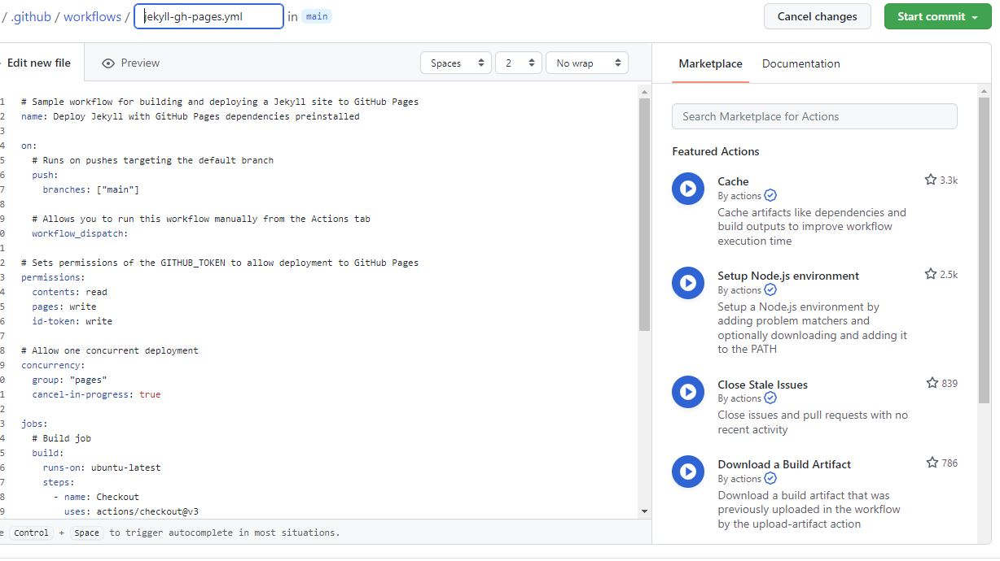

### 1단계 GitHub page 시작하기 

## 1. Repository 생성

우선 깃허브에서 이름이 didskfo.github.io인 Repository를 생성한다. 그리고 Settings에 들어가서 왼쪽에 Code and automation 파트의 Pages에 들어간다. 그리고 나서 Source가 Deploy from a branch로 되어있는 것을 GitHub Actions로 바꾼다. 그러면 사진과 같은 상태가 된다. 

여기서 GitHub Pages Jekyll의 Configure을 누르면 

로 이동하고 오른쪽 위의 초록색 버튼 Start commit 버튼을 누른 뒤 초록색 버튼인 Commit new file 버튼을 클릭한다. 
그러면 '<> Code' 페이지의 오른쪽에 

처럼 github-pages가 Active 된다. 

## 2. Local-Remote Repository 연동 

git clone을 하기 위해서 방금 만든 Repository의 주소를 복사한다. 

그리고 명령 프롬프트널에서 'git clone 방금 복사한 Repository의 주소' 를 입력한다. 
만들어진 폴더로 이동해서 'code .' 을 하면 vscode에서 코드를 수정할 수 있게 된다. 

## 3. Commit 하기 

vscode 왼쪽을 보면 

이렇게 생긴 것이 있는데 클릭하면 

이렇게 된다. 변경사항이 보여지고 Message 부분에 commit message를 입력하고 Commit 버튼을 누르면 


이렇게 변경되면 Sync Changes 버튼을 누르면 Commit이 완료된다. 

### 2단계 테마 추가하기 

## 1. Jekyll 설치하기

우선 Jekyll 공식 홈페이지에 들어간다. 들어가서 DOCS로 이동하면 

이 화면이 뜬다. 저기서 루비 개발환경을 설치하기 위해 클릭하면 

이런 화면이 뜬다. 윈도우를 사용하고 있기 때문에 윈도우즈를 클릭해서 RubyInstaller 다운로드 페이지로 이동해서 Ruby와 Dekit을 한 번에 설치하는 버전을 다운로드 받는다. 
루비 설치가 완료되면 명령 프롬프트에서 'gem install jekyll bundler' 를 입력한다. 설치가 완료되면 'jekyll -v' 를 통해 올바르게 설치되었는지 확인한다. 
이제 터미널에서 'jekyll serve' 를 실행하면 localhost:4000으로 접속할 수 있는 링크가 나온다. 

## 2. 테마 고르기 

다양한 Jekyll 테마가 있는 사이트에서 테마를 골랐다. 

마음에 드는 테마를 발견해서 Homepage 버튼을 누르면 Github 페이지로 이동한다. 그 Repository를 포크떠서 내 깃허브로 가져온 후 이름을 didksfo.github.io로 바꿔주었다.

### 3단계 댓글 기능 추가하기 

## 1. dispus

disqus.com 사이트에서 회원가입을 하고 필요한 코드를 추가하고 원하는 곳에 'comments: true'를 추가했는데 두 개의 포스트에서만 나타나고 다른 포스트에서는 나타나지 않는 문제가 발생했다.

## 2. utterances

disqus를 사용하였을 때 오류가 나서 다른 방법으로 utterances를 선택하였다. 

이 사이트에 들어가서 

여기의 'utterances app'을 클릭한 후 오른쪽의 'configure' 버튼을 누른 뒤 내 깃허브를 선택한다. 
그 후 'repo: owner/repo' 라고 쓰여있는 곳을 'didskfo/didskfo.github.io'로 변경한다. 그 후

이 코드를 복사해서 추가하면 되는데 나는 'utterances.html' 파일에 이미 있었기 때문에 따로 추가는 안했다. 
이 댓글 기능은 깃허브 인증을 하면 댓글을 남길 수 있는데 댓글을 쓰는 것은 가능한데 등록이 되지 않았다. 원인은 utterances는 깃허브의 'issues'를 데이터 저장소처럼 쓰는 데 
내가 포크 떠온 Repository에는 issues가 없었기 때문이다. 
이를 해결하기 위해 새로운 Repository를 생성하고 git clone을 해서 폴더를 만든 뒤 원래 있던 폴더에서 .github 폴더를 제외하고 나머지를 이동시켰다. 
그랬더니 정상적으로 추가가 되는 것을 볼 수 있다. 

### 4단계 내용 수정하기 

## 1. title 수정하기 

defaults.yml 파일 내용을 
```
home:
  heading: "STUDYLOG"
  subheading: "Record My Studies"
  banner: "assets/images/banners/studyimg1.jpg"
```
이렇게 수정하였다. 

## 2. posts 수정하기 

관련있는 git, github, jekyll부터 markdown, html, css에 대한 내용을 정리한 post로 수정했다. 

_posts 폴더에 YYYY-MM-DD-파일이름.md 파일을 추가하고 안에 
```
layout: post
title: About Git
subtitle: 깃이란 무엇인가
author: YangNarae
categories: git
banner: "assets/images/banners/git.png"
tags: git
```
이런 형태의 코드를 추가하고 밑에 내용을 작성했다. 

## 3. about.html 수정하기 

about.html 파일의 내용을 
```
<h2>About</h2>

<p>
<a href="https://github.com/didskfo">github</a>
</p>

<p>
email: didskfo@kookmin.ac.kr
</p>
```
이렇게 수정하였다. 

### 5단계 favicon 추가하기 

## 1. favicon 만들기 

원하는 이미지를 저장한다. 확장자는 png와 jpg 모두 가능하다.
[Favicon&AppIconGenerator](https://www.favicon-generator.org/) 사이트로 가서 

여기에서 파일을 선택한 뒤 Create Favicon 버튼을 누르면 favicon 이미지가 만들어진다. 

## 2. favicon 추가하기 
만들었던 favicon 이미지 중 16X16 사이즈의 이미지를 assets 폴더에 저장하고 
head.html 파일에 ```<link rel="icon" type="image/x-icon" href="assets/images/favicon.png">``` 를 추가한다. 그러면 완성이다. 